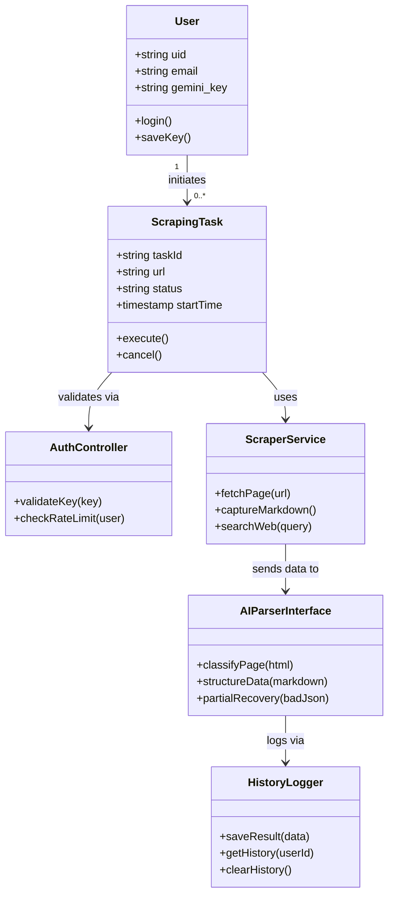

# Aria: Class Diagram

This diagram defines the static structural architecture of the Aria system components.

```mermaid
classDiagram
    class User {
        +string uid
        +string email
        +string gemini_key
        +login()
        +saveKey()
    }
    
    class ScrapingTask {
        +string taskId
        +string url
        +string status
        +timestamp startTime
        +execute()
        +cancel()
    }
    
    class AuthController {
        +validateKey(key)
        +checkRateLimit(user)
    }
    
    class ScraperService {
        +fetchPage(url)
        +captureMarkdown()
        +searchWeb(query)
    }
    
    class AIParserInterface {
        +classifyPage(html)
        +structureData(markdown)
        +partialRecovery(badJson)
    }
    
    class HistoryLogger {
        +saveResult(data)
        +getHistory(userId)
        +clearHistory()
    }

    User "1" --> "0..*" ScrapingTask : initiates
    ScrapingTask --> AuthController : validates via
    ScrapingTask --> ScraperService : uses
    ScraperService --> AIParserInterface : sends data to
    AIParserInterface --> HistoryLogger : logs via
```
