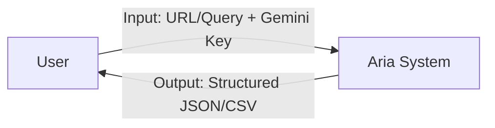
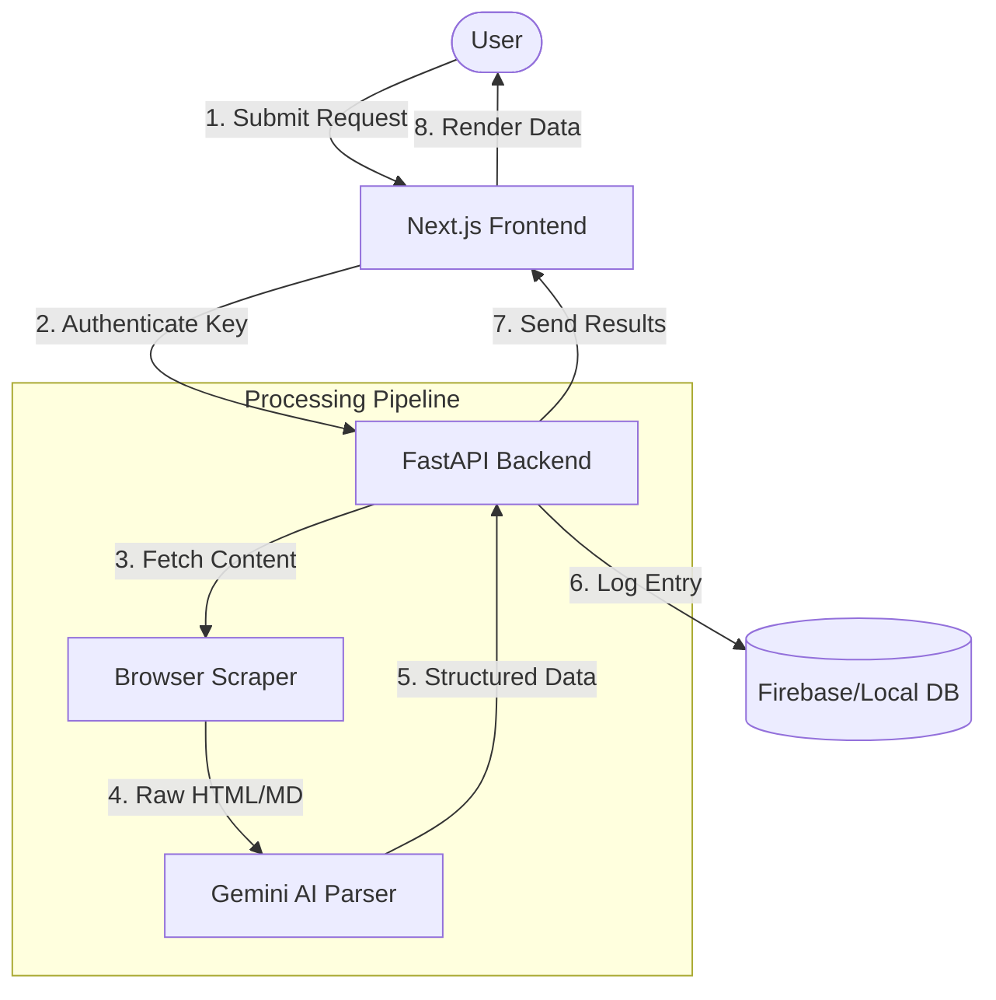

# Aria: Data Flow Diagram (DFD)

This diagram maps the flow of information from user input through the processing pipeline to the final structured output.

## Level 0: Context Diagram

## Level 1: Process Decomposition

