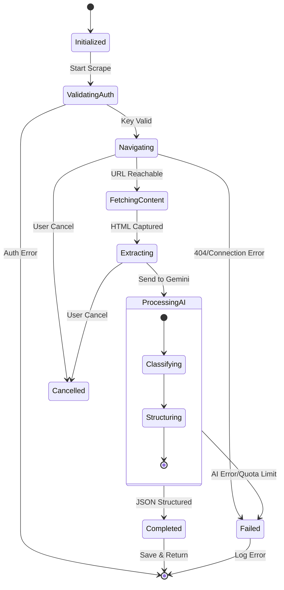

# Aria: State Chart Diagram

Visualizing the lifecycle and state transitions of a single ScrapingTask object.

```mermaid
stateDiagram-v2
    [*] --> Initialized
    
    Initialized --> ValidatingAuth : Start Scrape
    ValidatingAuth --> Navigating : Key Valid
    ValidatingAuth --> [*] : Auth Error
    
    Navigating --> FetchingContent : URL Reachable
    Navigating --> Failed : 404/Connection Error
    
    FetchingContent --> Extracting : HTML Captured
    
    Extracting --> ProcessingAI : Send to Gemini
    
    state ProcessingAI {
        [*] --> Classifying
        Classifying --> Structuring
        Structuring --> [*]
    }
    
    ProcessingAI --> Completed : JSON Structured
    ProcessingAI --> Failed : AI Error/Quota Limit
    
    Completed --> [*] : Save & Return
    Failed --> [*] : Log Error
    
    Navigating --> Cancelled : User Cancel
    Extracting --> Cancelled : User Cancel
```
