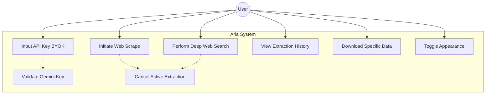

# Aria: Use Case Diagram

This diagram illustrates the primary interactions between the end-user and the Aria Web-Scraper system.

```mermaid
graph TD
    User((User))
    
    subgraph Aria_System [Aria System]
        UC1[Input API Key BYOK]
        UC2[Validate Gemini Key]
        UC3[Initiate Web Scrape]
        UC4[Perform Deep Web Search]
        UC5[View Extraction History]
        UC6[Download Specific Data]
        UC7[Cancel Active Extraction]
        UC8[Toggle Appearance]
    end

    User --> UC1
    User --> UC3
    User --> UC4
    User --> UC5
    User --> UC6
    User --> UC8
    
    UC1 -.-> UC2
    UC3 -.-> UC7
    UC4 -.-> UC7
```
